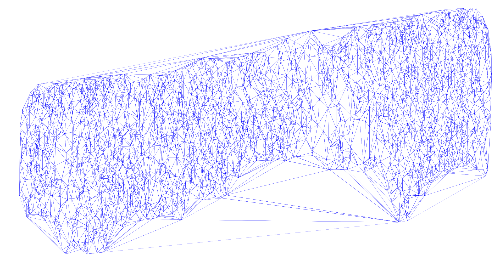

# DEM
An implement of the algorithm to build [Delaunay Triangulation](https://en.wikipedia.org/wiki/Delaunay_triangulation).
## Usage
use cpp to build the Triangulation.  
`gcc main.cpp`  
for windows, use  
`main.exe`  
or  
for linux, use  
`./main.o`  
then, use python to draw the delaunay triangulation  
`python draw.py`  
I recomand you to run it on windows because I havn't check whether it work well on linux.
## Result

